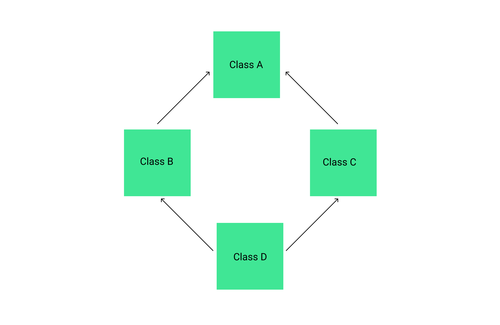

# Введение в язык C++

## Основные отличия C++ от C

В C был стек, автоматическое время хранения переменных + глобальное время хранения переменных + куча
В C++ осталось всё точно также, но добавился сборщик мусора и пространства имён.
Сборщик мусора занимается очищением объекта после блока.
Работа с кучей в Си осуществлялась при помощи функций malloc() - для выделения памяти и функции free() - для особождения памяти.
В C++ функцию malloc() заменило ключевое слово new, а функцию free - ключевое слово delete

## ООП

### Основные принципы ООП

Введем определения:

- **Абстракция** - отбрасывание несущественных характеристик для построения моделей при решении задачи.
- **Инкапсуляция** - Если очень коротко, то класс должен иметь 2 части: интерфейс и реализацию, при чём реализация должна быть скрыта. 
- **Наследование** - принцип, позволяющий создавать новые классы на основе существующих, путём уточнения.
- **Полиморфизм** - код может выполняться неодинаково в зависимости от объекта.

Если описать по-другому: принцип кибернетического чёрного ящика. Любой объект класса - это чёрный ящик, т.е. система, которая неизвестна, недоступна, сложна для описания.

Пример класса:

```cpp
class Light {
 bool on;
 public:
  Light() { on = false; }
  void switch() { on = !on }
  bool state() { return on; }
}
```

Объекты класса характеризуются значением полей.
В C++ появилось ключевое слово explicit - запрет неявного преобразования, т.е. если написать `explicit Light(bool init)`, то нельзя будет передать в конструктор что-то, кроме bool

### Области видимости при наследовании

Ниже приведена таблица изменения доступа к полям родительского класса при разных типах наследования:

| Родительский класс | Наследник `Private`   | Наследник `Protected`   | Наследник `Public`   |
|:------------------:|:---------------------:|:-----------------------:|:--------------------:|
|`Private`           | Недоступны            | Недоступны              | Недоступны           |
|`Protected`         | `Private`             | `Protected`             | `Protected`          |
|`Public`            | `Private`             | `Protected`             | `Public`             |

### Пространства имён


Пространство имен - это декларативная область, в рамках которой определяются различные идентификаторы.

Пространство имён пример:

```cpp
int x = 3;
namespace prog {
 int x = 2;
}
int main()
{
 int x = 5;
 {
  int x = 7;
  // x = 7
  // ::x = 3
  // prog::x = 4
 }
 return 0;
}
```

Пространство имён можно разделять:

```cpp
// ...
namespace prog {
 int x = 4;
}
// ...
namespace prog {
 int y = 2;
}
// ...
```

Пространства имён могут быть вложенными:

```cpp
// ...
// Вариант 1
namespace prog {
 namespace com {
  int x = 4;
 }
} 

// Вариант 2
namespace prog::com {
 int y = 2;
} 
// ...
prog::com::x // обращение к объекту в пространстве имён
...
```

Подключение объекта из области видимости: `using std::cout`.

Пространства имён в классе:

```cpp
class A{
 int m_x;
 public:
  int x();
  void x(int);
}
int A::x() { return m_x; }
int A::x(int x) { m_x = x; }
```

### Конструкторы

Введем определения:

- **Конструктор** - функция без возвращаемого значения, имя которой совпадает с именем класса.
- **Конструктор копирования** - Конструктор, параметр которого - константная ссылка на объект этого же класса.

Пример конструктора копирования:

```cpp
// ...
A(const &A obj) { m_x = obj.m_x }
// ...
A jbo;
jbo.x(6);
A obj = jbo; // тут вызывается конструктор копирования.
// A obj = jbo <=> A obj(jbo) <=> A obj = A(jbo)
```

**Деструктор** - специальный метод класса, выполняющийся при уничтожении объекта.

Пример деструктора:

```cpp
Matrix::~Matrix()
{
 delete[] data;
 data = NULL;
}
```

Класс ресурсоёмких объектов - класс, в котором выделяется память под внешний объект. В таких классах должен быть конструкторкопирования и деструктор.

### Таблицы символов

Программа после компиляции делится на секции. Из них есть две важные для нас: `.text` - код программы и `.bss` ß- сегмент данных.

- `objdump -t <файл>` - просмотр адреса таблицы символов
- `strip <файл>` - удаляет из файла информацию о символах для усложнения процесса ревёрса

**Дружественная функция** - внешняя функция, которая объявляется внутри класса и имеет доступ к полям класса

Пример:

```cpp
class A {
 ...
 friend int m(<args>);
}
int m (<args>) {/* Код функции */}
```

Перегрузка операций. В C++ можно определить арифметические операции для собственного класса. Для этого используется перегрузка операций. Пример перегрузки:

```cpp
class A {
 // ...
 friend A operator+(A, A);
 // ...
}
A operator+(A obj1, A obj2) { /* правило сложения двух объектов */}
// ...
A a, b;
/*Действия над a и b*/
a + b; 
// ...
```

Перегружать можно:

- Обычные операторы (арифметические, присваивания, комбинированные арифметические, унарные арифметические, сравнения, побитовые операторы, логические, инкремент и декремент, квадратные и кргулые скобки)
- Операторы преобразования типа
- `new` и `delete`

Также можно перегружать функции. Пример перегрузки функции в классе:

```cpp
#include <iostream>
struct Base {
 void Hello() { cout << "Base"; }
}
struct Derived : public Base
{
 void Hello() { cout << "Derived"; }
}
print_hello(const Base& b)
{
 b.Hello();
}
int main()
{
 Derived d;
 print_hello(d); // Выведет "Base"
 return 0;
}
```

Чтобы программа вывела "Derived" надо в структуре Base объявить функцию Hello как виртуальную:

```cpp
#include <iostream>
struct Base {
 virtual void Hello() { cout << "Base"; }
}
struct Derived : public Base
{
 void Hello() { cout << "Derived"; }
}
print_hello(const Base& b)
{
 b.Hello();
}
int main()
{
 Derived d;
 print_hello(d); // Выведет "Base"
 return 0;
}
```

**Полиморфный класс** - класс, у которого объявлен хотя бы один виртуальный метод

Ключевое слово virtual создаёт общую таблицу на всех наследников. Во всех наследниках класса можно будет перегружать, а не переопределять методы. Существует также чистый виртуальный метод.

Pure virtual (Чистый виртуальный метод) - Метод, который не предполагает наличие тела.

```cpp
virtual void Hello() const = 0; // чистый виртуальный метод
```

Абстрактный класс - это класс, в котором есть хотя бы 1 чистый виртуальный метод

Создать объект абстрактного класса нельзя. Абстрактный класс используется для описания интерфейса класса. В наследниках обязано быть тело метода, объявленного в абстрактном классе.

#### Проблема ромбовидного наследования



**Ромбовидное наследование** — ситуация в объектно-ориентированных языках программирования с поддержкой множественного наследования, когда два класса B и C наследуют от A, а класс D наследует от обоих классов B и C. При этой схеме наследования может возникнуть неоднозначность: если объект класса D вызывает метод, определенный в классе A (и этот метод не был переопределен в классе D), а классы B и C по-своему переопределили этот метод, то от какого класса его наследовать: B или C?

Вот пример такой ситуации:

```cpp
#include<iostream>
using namespace std;
class Person { //class Person
public:
 Person(int x) { cout << "Person::Person(int) called" << endl; }
};

class Father : public Person { //class Father inherits Person
public:
 Father(int x):Person(x) {
 cout << "Father::Father(int) called" << endl;
 }
};

class Mother : public Person { //class Mother inherits Person
public:
 Mother(int x):Person(x) {
  cout << "Mother::Mother(int) called" << endl;
 }
};

class Child : public Father, public Mother { //Child inherits Father and Mother
public:
 Child(int x):Mother(x), Father(x) {
  cout << "Child::Child(int) called" << endl;
 }
};

int main() {
 Child child(30);
}
```

Такой код выведет следующее:

```bash
Person::Person(int) called
Father::Father(int) called
Person::Person(int) called
Mother::Mother(int) called
Child::Child(int) called
```

Можно заметить, что конструктор класса Person вызывается дважды (один раз от класса Father, один раз от класса Mother). Т.к. конструктор вызывается дважды, то и деструктор вызывается дважды, во время уничтожения объекта класса Child. Чтобы решить проблему ромба, мы должны добавить ключевое слово virtual при наследовании:

```cpp
#include<iostream>

using namespace std;


class Person { //class Person
public:
    Person() { cout << "Person::Person() called" << endl; } //Base constructor
    Person(int x) { cout << "Person::Person(int) called" << endl; }
};
 
class Father : virtual public Person { //class Father inherits Person
public:
    Father(int x):Person(x) {
       cout << "Father::Father(int) called" << endl;
    }
};
 
class Mother : virtual public Person { //class Mother inherits Person
public:
    Mother(int x):Person(x) {
        cout << "Mother::Mother(int) called" << endl;
    }
};
 
class Child : public Father, public Mother { //class Child inherits Father and Mother
public:
    Child(int x):Mother(x), Father(x) {
        cout << "Child::Child(int) called" << endl;
    }
};
 
int main() {
    Child child(30);
}
```

- Вывод:

```bash
Person::Person() called
Father::Father(int) called
Mother::Mother(int) called
Child::Child(int) called
```

### Файловые потоки

- Подключение: `#include <fstream>`
- Открытие файла на чтение:

```cpp
std::ifstream in("<in_filename>");
if(!in.is_open()) { /*Не удалось открыть файл*/ }
```

- Чтение с потока: `in >> c;`
- Открытие файла на запись:

```cpp
std::ofstream out("<out_filename>");
if(!out.is_open()) { /*Не удалось открыть файл*/ }
```

- Запись в поток: `out << "Hello, world!";`
- Закрыть файл: `out.close(); in.close()`

### Манипуляции с потоками

Манипуляторы используются для контроля вывода. Например: можно установить количество знаков после запятой для дробного числа, которое надо вывести. Использование манипуляторов:

```cpp
#include<iomanip> // Подключение
// ...
cout << boolalpha << true; // вывести bool-значение как строку
cout << setprecision(12) << 1.2345678901234; // Вывести число с 12 знаками после запятой
```

Чтобы изменить язык на русский используется функция: `setlocale(LC_ALL, "RUS")`
