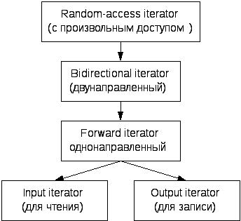

# Шаблоны, шаблоны, шаблоны

## Что такое шаблоны и с чем их едят?

Напишем код сортировки пузырьком:

```cpp
void sort(int *data, size_t size)
{
 for(int j = 0; j < size; j++)
 {
  for(int i = j+1; i < size; i++)
  {
   if(data[j] < data[i])
   {
    int t = data[j];
    data[j] = data[i];
    data[i] = t;
   }
  }
 }
}
```

А теперь предположим, что мы хотим сортировать не int-массив, а массив из собственных классов. Мы определили для него операторы сравнения и присваивания, но нам неудобно переписывать один и тот же код, просто меняя типы. Для этого были придуманы шаблоны. Шаблонный код будет выглядеть так:

```cpp
template<typename T>
void sort(T *data, size_t size)
{
 for(int j = 0; j < size; j++)
 {
  for(int i = j+1; i < size; i++)
  {
   if(data[j] < data[i])
   {
    T t = data[j];
    data[j] = data[i];
    data[i] = t;
   }
  }
 }
}
```

При компиляции автоматически будут сгенерированы функции с конкретными типами вместо шаблона T.

## Стандартная библиотека шаблонов

STL - стандартная библиотека шаблонов. Базируется на четырёх элементах:

1. Итераторы - специальные классы, которые помогают перемещаться по контейнеру.
2. Контейнеры - объекты, используемые для хранения других объектов.
3. Функторы - классы, у которых переопределён оператор круглые скобки. Отличается от функий тем, что в класс можно инкапсулировать.
4. Алгоритмы - готовые реализации алгоритмов.

Классификация контейнеров STL:

- Последовательные (вектор, списки)
- Ассоциативные (Множества, отображения)
- Класс адаптор - класс, который использует другой контейнер для хранения данных, а сам представляет собой интерфейс

Классификация итераторов:

- Итераторы вывода (`output`)
- Итераторы ввода (`input`)
- Итератор прямого доступа (однонаправленный, `forward`) - может перемещаться в одну сторону с помощью операции `++`. Работает таким же образом, как и `input`
- Итератор двунаправленный (`bidirectional`) - может перемещаться в обе стороны, т.к. перегружены оператции `++` и `--`.
- Итератор произвольного доступа (`random access`) - перегружены квадратные скобки

Перегрузки итератора вывода (`output`):

- `b = a;`
- `*r++ = var;`
- `++r;`
- `r++;`
- `*r = t;`

Перегрузки итератора ввода (`input`):

- `b == a;`
- `*i;`
- `++r;`
- `i->m; // или (*i).m`
- `i != j;`
- `*r++;`

Перегрузки однонаправленного итератора (`one direction`):

- То же самое, что и в `input` итераторе
- `r++;`

Перегрузки двунаправленного итератора (`biderctional`):

- (Те же операторы, которые поддерживались `one direction` итератором)
- `--a;`
- `a--;`
- `*a--;`

Перегрузки двунаправленного итератора (`random access`):

- То же самое, что и в `bidirectional` итераторе
- `r += n;`
- `a + n; // и n + a`
- `i - n`
- `i - j` (возвращает количество элементов между итераторами)
- `i[n]`
- `a < b`

Схема наследования итераторов:

