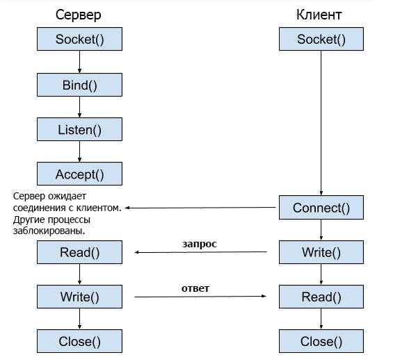

# Cетевое взаимодействие

**Определения:**

- Локально-вычислительная сеть (ЛВС, LAN) - сеть, покрывающая небольшую территорию
- Интернет - Глобальная сеть. Является множеством взаимодействующих между собой ЛВС
- DNS (Domain Name System) - Системиа, сопоставляющая домен и информацию о нём (например IP)
- Сокет - связка IP и порта

Сокеты могут быть связаны полнодуплексным или полудуплексным способом соединения. Для работы с сокетами используются следующие функции:

- Для создания сокета - команда `socket()`
- Для передачи данных - команды `read()` и `write()`, если это TCP-соединение, а если установлено UDP-соединение, то команды `recvfrom()` и `sendto()`
- Для установки соединения:
  - `connect()` - нужна для установки соединения. Применяется только в TCP
  - `bind()` - привязывает сокет к адресу
  - `listen()` - ожидает входное соединение. В параметрах передаётся размер очереди на Подключение
  - `accept()` - принять сокет из очереди и перевести клиента на новый сокет, чтобы внешний сокет был всегда доступен

## Взаимодействие клиента и сервера

Вот схема взаимодействия клиента и сервера:



Алгоритм действия сервера:

1. Создаём сокет `socket()`
2. Выполняем привязку сокета `bind()`
3. Ожидание входящих соединений `listen()`
4. Диспетчеризация `accept()`
5. Работа с данными клиента `read()` и `write()`

Алгоритм действия клиента:

1. Создать сокет `socket()`
2. Подключиться к серверу `connect()`
3. Работа с данными клиента `read()` и `write()`

Пример сервера:

```cpp
// Пример кода сервера

#include <netinet/in.h>
#include <stdio.h>
#include <stdlib.h>
#include <string.h>
#include <sys/socket.h>
#include <unistd.h>
#define PORT 8080
int main(int argc, char const* argv[])
{
 int server_fd, new_socket, valread;
 struct sockaddr_in address;
 int opt = 1;
 int addrlen = sizeof(address);
 char buffer[1024] = { 0 };
 char* hello = "Hello from server";
 
 // Создаем дескриптор файла сокета
 if ((server_fd = socket(AF_INET, SOCK_STREAM, 0)) < 0) {
  perror("socket failed");
  exit(EXIT_FAILURE);
 }
 
 // Натсраиваем сокет
 if (setsockopt(server_fd, SOL_SOCKET,
     SO_REUSEADDR | SO_REUSEPORT, &opt,
     sizeof(opt))) {
  perror("setsockopt");
  exit(EXIT_FAILURE);
 }
 address.sin_family = AF_INET;
 address.sin_addr.s_addr = INADDR_ANY;
 address.sin_port = htons(PORT);
 
 // Привязываем сокет к порту 8080
 if (bind(server_fd, (struct sockaddr*)&address,
    sizeof(address))
  < 0) {
  perror("bind failed");
  exit(EXIT_FAILURE);
 }
 if (listen(server_fd, 3) < 0) {
  perror("listen");
  exit(EXIT_FAILURE);
 }
 if ((new_socket
   = accept(server_fd, (struct sockaddr*)&address,
     (socklen_t*)&addrlen))
  < 0) {
  perror("accept");
  exit(EXIT_FAILURE);
 }
 valread = read(new_socket, buffer, 1024);
 printf("%s\n", buffer);
 send(new_socket, hello, strlen(hello), 0);
 printf("Hello message sent\n");
 
 // Закрываем файловый дескриптор сокета
 close(new_socket);
 // Перестаем слушать сокет и сообщаем серверу об этом
 shutdown(server_fd, SHUT_RDWR);
 return 0;
}
```

Пример клиента:

```cpp
// Пример кода клиента

#include <arpa/inet.h>
#include <stdio.h>
#include <string.h>
#include <sys/socket.h>
#include <unistd.h>
#define PORT 8080
  
int main(int argc, char const* argv[])
{
    int status, valread, client_fd;
    struct sockaddr_in serv_addr;
    char* hello = "Hello from client";
    char buffer[1024] = { 0 };
    if ((client_fd = socket(AF_INET, SOCK_STREAM, 0)) < 0) {
        printf("\n Socket creation error \n");
        return -1;
    }
  
    serv_addr.sin_family = AF_INET;
    serv_addr.sin_port = htons(PORT);
  
    // Преобразование адресов IPv4 и IPv6 из текстового формата в двоичный
    if (inet_pton(AF_INET, "127.0.0.1", &serv_addr.sin_addr)
        <= 0) {
        printf(
            "\nInvalid address/ Address not supported \n");
        return -1;
    }
  
    if ((status
         = connect(client_fd, (struct sockaddr*)&serv_addr,
                   sizeof(serv_addr)))
        < 0) {
        printf("\nConnection Failed \n");
        return -1;
    }
    send(client_fd, hello, strlen(hello), 0);
    printf("Hello message sent\n");
    valread = read(client_fd, buffer, 1024);
    printf("%s\n", buffer);
  
    // Закрываем файловый дескриптор сокета
    close(client_fd);
    return 0;
}
```

## Рекомендации

Для того, чтобы самостоятельно разобраться в теме, советую [гайд Биджи по сетевому программированию](https://beej.us/guide/bgnet/translations/bgnet_A4_rus.pdf).
